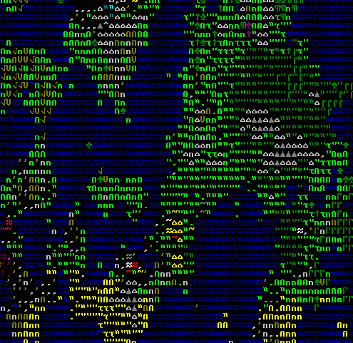
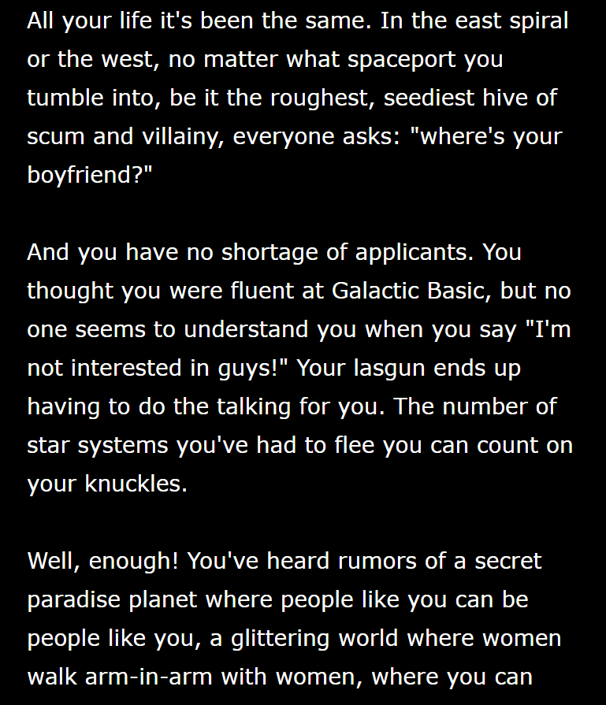
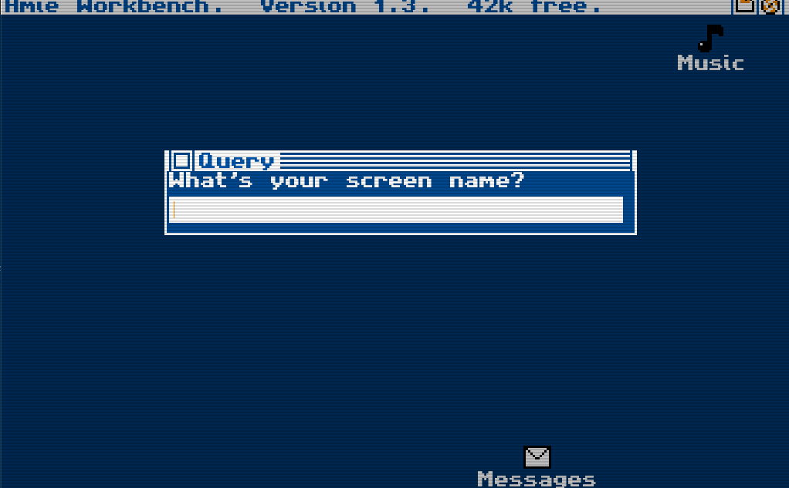
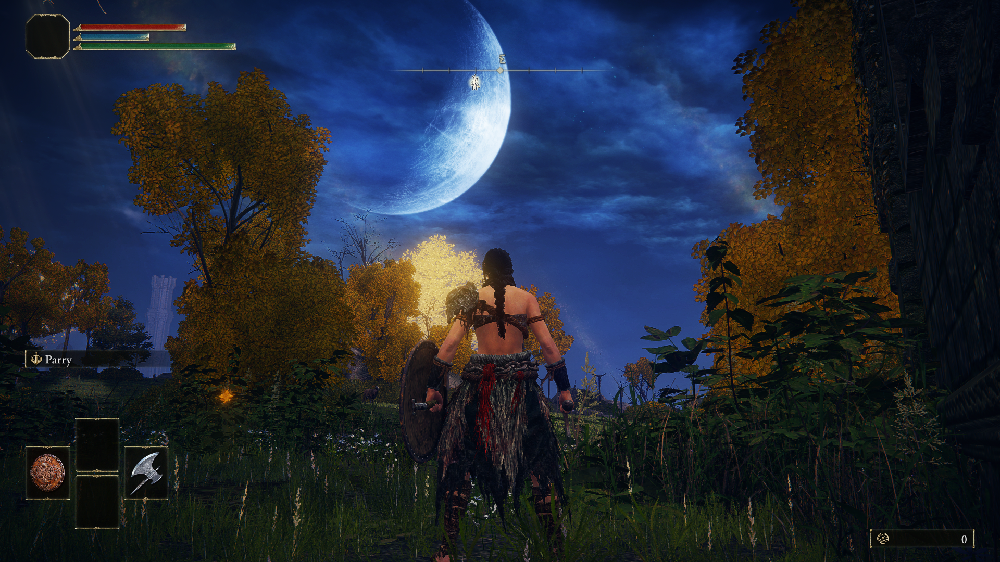
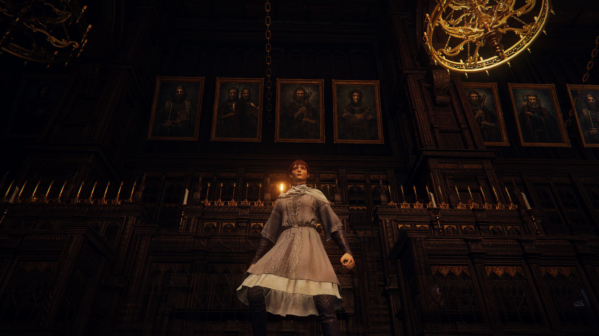

# Exercises

## Week 1

 - [x] Create GitHub account
 - [x] Do the GitHub 'Hello World'
 - [x] Add a repositry for the folio

### Questions

#### What types of writing do you do?

I really enjoy all things fiction, particularly fantasy. Something about a world of unknown things where anything can happen really draws me in and is the reason I enjoy writing (and reading). Recently, I've also been enjoying poetry, although I have extremely limited experience with it. I tend to write free verse as it allows me to express my emotions and thoughts without the restrictions of rhyme and rhythm, I can focus on the beauty of the words and the emotions behind them.

#### What tools (or techniques) do you use to write?

I use word, specifically I use Garamond font until I need to hand it in, then I switch to Times New Roman. It's a small thing, but it can often help me a lot with my writing, especially if it's a creative piece. Ever since I starting taking writing somewhat seriously, I have used Garamond font. 

The technique I use can change; sometimes I'll have loud music blasting, other times I'll need complete silence or a loop of white noise (static). I've found sound has a huge impact on my ability to zone the world out and bring myself into my writing. Sometimes the world is all too loud and my brain feels foggy so I just need silence, although I'll still have headphones on to feel comfortable with what I'm used to; other times I'll have no motivation and I need the DOOM soundtrack on full-ball. It really depends, but sound is incredibly important to my ability to write.

I often search for images as inspiration for what I want to write, whether it be looking for a generic foggy night, or a screenshot from a very specific part of a game I played years ago. I often find something that I like and it will have other elements to it that I haven't thought of, which I can then introduce into my own writing.

#### How do these tools shape the way you write (e.g.,constrain the way you write or facilitate your writing)?

Writing on Word means I am limited in the way I can interact with the audience, there is only words on a page. I can aim to make the reader feel a certain way, to push them into a specific mindset, but I can not interact with them the same way a video game or piece of digital writing can. Perhaps it would be more accurate to say that 
standard fiction doesn't limit how you can interact with the reader, but instead, it limits the ways in which the reader can interact with *you*. 

***

## Week 2

|Title|Pros|Cons|images|
|-------|-------|----|-----|
|Dwarf Fortress|Looks really fun, obviously has a lot of thought into it, enjoyable old-school ASCII look|Extremely hard to understand, no story, is more game than digital story||
|The Hunt for the Gay Planet|Humorous, gay (same), a lot of content|The story feels extremely locked, your decisions are either right or wrong, feels very padded, purely text||
|Digital: A Love Story|Really cool visuals, feels like you're actually using an old PC, really nice background music, genuinely engaging story, funny references trickled throughout (such as Star Trek references), gameplay is engaging|No actual choices, the dial up system gets old after a while, a lot of guessing what to do next||

I ended up choosing Digital: A Love Story because of the pros listed above. It really interested me the most out of the ones I looked at and I don't think I'll regret it. The visuals, sounds, and story are all very up my alley, and I look forward to understanding more about it. I've learnt that it is actually very well recieved online, with people still talking about it and listening to the [music](https://youtu.be/MQ4s7hn1mlk) online through YouTube.

***

## Week 3

This week has no class due to a holiday, but I thought I would still put an entry here discussion an interesting mode of story telling that has recently boomed with the release of *Elden Ring*. 

### Elden Ring & Other FromSoftware Games

Elden ring is a newly released game from FromSoftware, the company that has most notably released games such as Dark Souls (1, 2 & 3), Sekiro, and Demon Souls. This is important because they have a very particular style of video games that no other gaming company has been able to fully replicate, and while some of their choices can be passed off as a purely gameplay choices, I believe they all contribute to the way the game chooses to tell the story of the world. These are some of the elements I believe FromSoftware games (including Elden Ring) are unrivaled in their story telling abilities.

#### Difficulty

FromSoftware games have become infamous as some of the most difficult singleplayer games to be released. They lack a difficulty slider, being locked at the same difficulty for everyone. While this has recieved criticism from some, it is also a large reason for its success. The choice makes every success feel hard earnt, it removes the ability to make things easier for yourself, and it keep your tension up when playing. Many people who have finished the games admit they would have made the game easier for themselves if they were given the option, but are also glad they were not given the option. 

While this is great from a gameplay perspective, how does it affect the storytelling? Massively. The story of all of FromSoftware games are similar to a degree, in that you are a nobody, whether it be an undead (Dark Souls 1), a hollow (Dark Souls 2), or a tarnished (Elden Ring). You have the world against you, and FromSoftware wants you to know that not just through the story but also through the difficulty. Having to struggle through every stage of the game, growing slowly in strength, until you are fighting literal gods, is a core element of storytelling in FromSoftware games.

#### Hidden Story

Another element of storytelling in Elden Ring and other FromSoftware games, is in the way in which the story is delivered. Although Elden Ring is probably one of the more accessible in how it tells the story, it still follows the pattern that all FromSoftware games follow, with story hidden rather than told to the player. It chooses to hide a significant amount of the story within the descriptions of some of the hundreds of items that can be picked up throughout the world. It uses NPCs that are easily missable on your journey (or even actively hidden behind fake walls) to tell you about the lore. By choosing to hide the story and lroe of the world like this, it actively makes it harder for the player to get a full picture of what is going on. This is intentional. Through making the story harder to engage with, they're making the engagement of it that players *do* get more enjoyable. By hidding a vast amount of the lore, the player is encouraged to build their own knowledge and understanding of the story through the elements they have found themselves. However, if players are interested in the whole story they are able to look up lore videos online which give an extensive overview of the story, although these videos are far from complete even on the oldest FromSoftware games due to the story being so well hidden that even the people who dedicate time to figuring it out can not know all of it.

There is lore even added to the detailing of the moon that is not pointed out or referenced in the game, but just left for the player to figure out and draw their own conclusions to.

#### World 

The final element which I want to talk about is the world in which the player is able to explore. While many open world video games have storytelling throughout the world, few do it in such an effective way as Elden Ring. Every part of the world creates more lore for the player to notice, much like the real world reflects the past. For instance, in a hall of a magic academy, there is picture after picture hung up of male professors, with only one female professor that the player might recognise from earlier in the game (if they had found her). These pictures are easy to miss but reward the player with the knowledge that she was important enough to still have her picture up after being kicked out from the academy. 

Storytelling through the world is one of the most impactful and interesting elements of storytelling in video games, and none do it better than FromSoftware.

***

## Week 4

### We Walk to You Remix

[The night has eyes](https://dot-ivy-vision.glitch.me)

I created this poem with the remaining time after the presentations. I found it really fun and an interesting way to interact with poems. The idea of a generating poem is something I find particularly interesting, and makes me wonder how large of a scale this could be done. I know there are A.I. generated books, but I wonder if you could make an infinitely scrawling story like this that actually makes sense without the use of A.I. I guess it depends on the meaning of A.I. though, would this poem be considered A.I.? I don't think so.

***

## Week 5

This week I made a *very* basic twine story in order to try the software and to practice publishing it to Netlify. It was less of a story and more just a way to trying things out. I enjoyed the method of twine, it was an interesting way to develop a story. Being able to plan a tree of choices that the reader could go through was fun and felt like it had a lot of potential. Even just plotting the narrative through the boxes, seeing them all connect to each other, was exciting to me. This is something I'm definitely going to consider for my final work as I find the process really fun, although I wish I could change the style completely of the finished product, similarly to how *Digitall: A Love Story* made it look like an old PC.

[Test Website Made in Twine](https://cerulean-salmiakki-9ccfa6.netlify.app "Website link")

***

## Week 6

We went through more ideas for media in which we want to present our final works in class, including Inform 7 and Bitsy. I really liked these programs as they gave a more 'game-like' way of interacting with the environment to the reader. However, both had massive problems that make them almost unusable for what I want to do.

#### Bitsy

Bitsy was extremely promising, the idea of being able to create a visual game and environment from which the audience can interact with was appealing. Being able to create my own visual assets from which I could build the story also appealed to my artistic side. The idea I was thinking of for a story using this medium was to have a side-view of a mountain that the player needs to climb, the mountain slowly gets more and more hostile (visually) and the story of why they are climbing the mountain becomes apparent as they climb. There would be nothing telling them to climb, they would be perfectly able to stop climbing or to go down, but they would be driven by their own ambition to climb the mountain. 
I soon ran into a few issues that made this idea impossible and ruined my ideas to use this software at all. 

 * The lack of colour choice. Unfortunately, the program only allows 3 colours for each level, severely limiting the creative options I have for creating an intersting environment that could tell the story. It also restricted the amount of 'blocks' that you could use, only having a background, a wall, or an item/person. This was extremely disappointing right off the bat.
 * Not being able to add basic physics and gravity. This was mostly only an issue due to the story I wanted to create with the perspective I was using. This program was clearly designed with a top-down view in mind, so my side-view choice wasn't really viable as the player could just fly into the sky with the lack of gravity.
 * Very basic storytelling capabilities. While it did allow for IF commands and a basic inventory system, it still was lacking many of the storytelling capabilities I would have like to have, such as NPCs moving, audio, and movement animations.

#### Inform 7 

Inform was a much more viable option, although the effect wouldn't quite be the same as with a visual presentation from Bitsy. This was not not a bad choice at all, however, I felt like this medium would require a lot of work to make the story effortlessly flow. It felt more like it was meant to make a choose-your-own-adventure then a *story*, not that I have anything against choose-your-own-adventure books. This felt like something I would want to experiment with but maybe not for my final project as I want it to be more story-driven.

